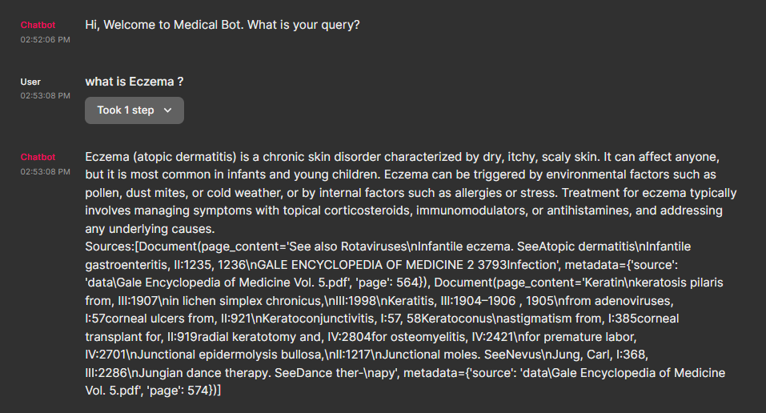
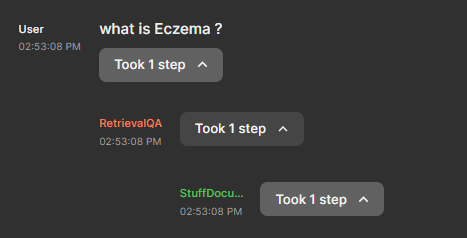
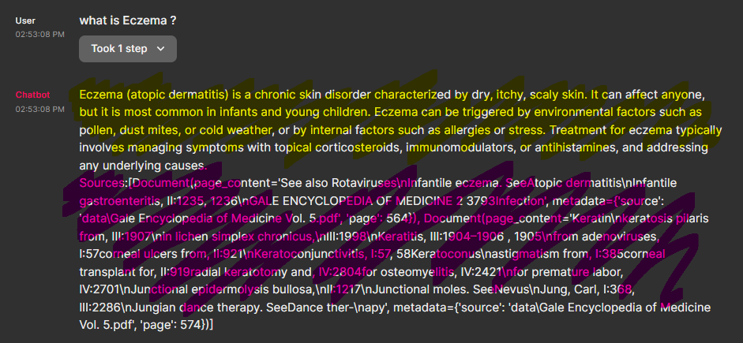
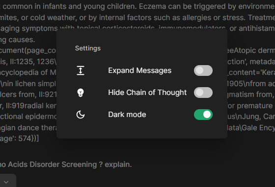
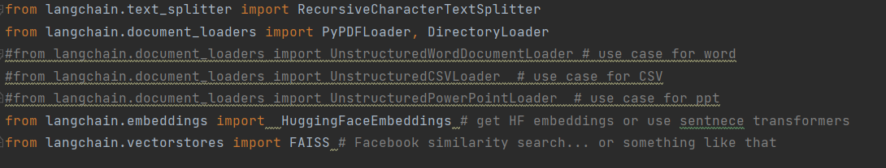
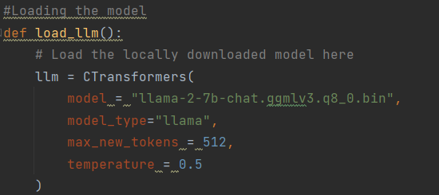
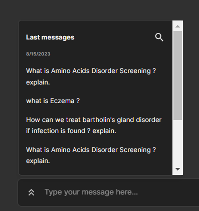

# **Chainlit Agent Based LLama model**

### User window

### Question based on text data in the pdf in data folder
##### here we are sourcing it from the 2004 edition of the book : Gale Encyclopedia Of Medicine

#### Here the response time highly depends on the Host computer resources as RAM and Processor (Min 8 GB RAM/Ideal 16 RAM).

#### Each of the Function calls can be tracked here to give the User a idea of the train of thought/process happening in the Background.

#### High lights
1.) Yellow text : This is the LLAMA 2B response.

2.) Pink text : This is the exact source from the ~600 Page Book from where the data was extracted and vectorized.

#### Chainlit is powerful as it allows for inbuilt customisations which are similar to streamlit.

#### Based on my understanding this can be expanded to other raw and unstructured Data sets as PPTS,Raw Docs,CSVs.
#### This gives a truely intelligent data outputs and is core in our Porject Usecase.

#### The Llama model can be replaced by any of the models downloaded from other sources as Huggingface Hub or Github in general.
##### This allows for a wide usecase application.

#### The creativity of the model can be changed or altered in the temperature parameter.

#### It also has the added advantage of reiterating ut's search as the old  queries and answers are left in memory.