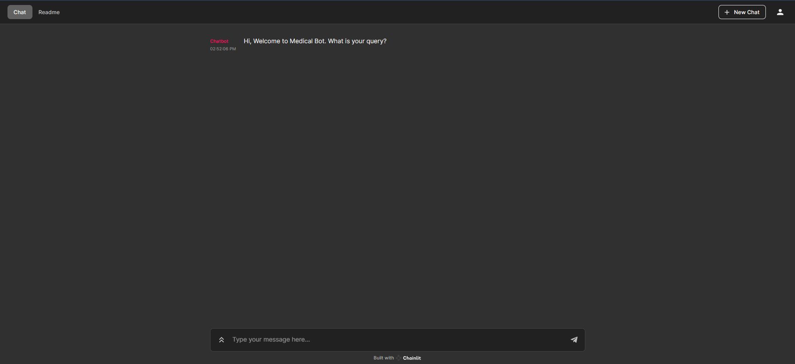

# **Chainlit Agent Based LLama model**

###User Note : Please 1st Download and place the LLAMA 2B model into native directory before running the program.

**Download LLAMA 2b here :** https://huggingface.co/TheBloke/Llama-2-7B-Chat-GGML/blob/main/llama-2-7b-chat.ggmlv3.q8_0.bin

(size of model is 6gbs so not possible to push if not in repo (may have automatically been rejected by repo management system)

0.) Dowload the said model

1.) Run Ingest.py

2.) later run model.py

3.) Run command in terminal : chainlit run model.py -w

4.) User window automatically pops up as see in readme,md

### User window

### Question based on text data in the pdf in data folder
##### here we are sourcing it from the 2004 edition of the book : Gale Encyclopedia Of Medicine

#### Here the response time highly depends on the Host computer resources as RAM and Processor (Min 8 GB RAM/Ideal 16 RAM).

#### Each of the Function calls can be tracked here to give the User a idea of the train of thought/process happening in the Background.

#### High lights
1.) Yellow text : This is the LLAMA 2B response.

2.) Pink text : This is the exact source from the ~600 Page Book from where the data was extracted and vectorized.

#### Chainlit is powerful as it allows for inbuilt customisations which are similar to streamlit.

#### Based on my understanding this can be expanded to other raw and unstructured Data sets as PPTS,Raw Docs,CSVs.
#### This gives a truely intelligent data outputs and is core in our Porject Usecase.

#### The Llama model can be replaced by any of the models downloaded from other sources as Huggingface Hub or Github in general.
##### This allows for a wide usecase application.

#### The creativity of the model can be changed or altered in the temperature parameter.

#### It also has the added advantage of reiterating ut's search as the old  queries and answers are left in memory.

### Overlay of the process

### References

Llama 2 Model (Quantized one by the Bloke): https://huggingface.co/TheBloke/Llama...

Llama 2 HF Model (Original One): https://huggingface.co/meta-llama

Chainlit docs: https://github.com/Chainlit/chainlit

Faiss GitHub: https://github.com/facebookresearch/f...

AI Anytime: https://github.com/AIAnytime

Langchain Docs: https://python.langchain.com/docs/get...

Sentence Transformers Hugging Face: https://huggingface.co/sentence-trans...

CTransformers GitHub: https://github.com/marella/ctransformers